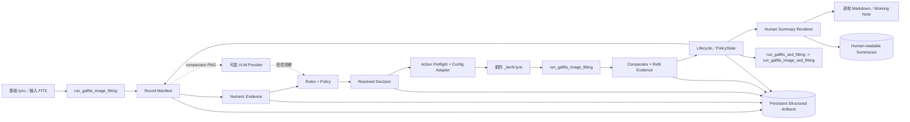
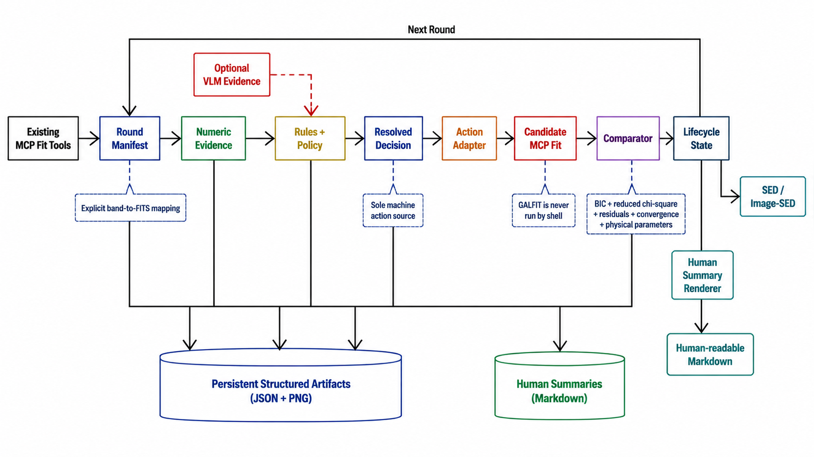

# 新成分分析模块接管多波段 Workflow：架构说明

日期：2026-09-02

本文回答两个问题：新 workflow 每一轮到底做什么，以及每一步由哪些文件负责。本文描述的是 `COMPONENT_ANALYSIS_WORKFLOW_PILOT=1` 打开的结构化路径；旧的单波段路径仍由 `src/prompts/workflow_galfit.md` 维护，不会被本方案隐式替换。

## 1. 先看结论

1. `104` 的 `output` 下有很多拟合目录，主要原因是该对象的 output 目录复用了历史运行和多次 canary／续跑结果。当前 `/tmp/jwst0831-pilot-full-xo2S8L/` 这次运行对 `104` 实际只有 `round_000`、`round_001` 两轮 Image workflow，另有一次 SED／Image-SED 收尾；不能把 output 目录总数当成当前 workflow 轮数。
2. pilot 报告第 35 行的“规则原因均为 `DISK_N_NOT_FIXED`”是旧实现的工程动作原因，不是“科学上已经确认三个对象都是 Disk”。旧适配器把首轮未标注的单个 `obj0 + Sersic` 默认解释成 Disk，于是规则层要求把 `n` 固定为 1。按现在确认的科学口径，首轮单个 Sersic 必须保持“未分类”，只有成分分析明确确认 Disk 后，才允许出现 `DISK_N_NOT_FIXED`。
3. `component_analysis.md` 和 `working_note.md` 当前确实存在，但只存在于临时 workflow artifact 根目录下，而且是占位式审计文本，不是 JWST0716 那种逐轮科学总结。当前真实路径示例：

   ```text
   /tmp/jwst0831-pilot-full-xo2S8L/objects/104/working_note.md
   /tmp/jwst0831-pilot-full-xo2S8L/objects/104/round_000/component_analysis.md
   /tmp/jwst0831-pilot-full-xo2S8L/objects/104/round_000/workflow_analysis_artifact.json
   ```

   实际拟合的 FITS、summary 和 comparison PNG 仍在对象的 `output/` 目录中。

## 2. 术语对应关系

| 名称 | 它是什么 | 当前代码位置 | 是否能直接决定动作 |
|---|---|---|---|
| round | 一次明确登记的拟合结果和它对应的分析／决策 | `src/tools/workflow_batch_runner.py` | 否，round 是上下文 |
| manifest | 一张显式索引表，记录 lyric、波段顺序、每个波段 result FITS 和 HDU、summary、comparison、PSF、mask | `src/component_analysis/artifact_adapter.py`、`src/schemas/workflow_round_manifest.schema.json` | 否，是输入契约 |
| numeric evidence | 从 FITS、WCS、残差和 summary 测得的确定性事实，例如源尺度、轴比、残差、参数健康 | `src/component_analysis/numeric.py`、`src/component_analysis/derived.py` | 否，只提供证据 |
| VLM／external provider | 可选的外部视觉模型服务。它只看受控图片和受控标签问题，返回形态观察 | `src/component_analysis/vlm.py`、`decision_service.py` | 否，不能写 lyric 或执行拟合 |
| decision artifact | 规则和 policy 根据 numeric／VLM 证据生成的结构化结果；其中 `resolved_decision` 是唯一机器动作来源 | `src/component_analysis/rules.py`、`policy.py`、`decision_service.py`、`src/schemas/decision_artifact_v1_1.schema.json` | 是，只有这里的 resolved action 能进入下一步 |
| action adapter | 把已批准的结构动作转换成新的 `_iterN` lyric，并检查参数和约束 | `src/component_analysis/workflow_bridge.py` | 否，不能自己运行 GALFIT |
| comparator／refit evidence | 比较 baseline 和 candidate 的确定性证据，包括残差、BIC、reduced chi-square、收敛和参数健康 | `src/component_analysis/refit_comparator.py` | 由规则层解释；强制 Disk n=1 与结构候选使用不同门槛 |
| lifecycle／PolicyState | 对象级事件历史、当前配置、候选结果、review 状态和下一步状态 | `src/component_analysis/workflow_bridge.py`、`src/tools/workflow_lifecycle.py`、`src/schemas/workflow_lifecycle.schema.json` | 是状态来源，但不是自由文本来源 |
| Working Note／component analysis Markdown | 给人看的解释和审计材料 | 当前由 runner 写占位文本；目标由后续 summary renderer 生成 | 否，禁止反向解析动作 |
| external provider | `OpenAICompatibleVLM` 使用的 OpenAI-compatible HTTP 服务 | `src/component_analysis/vlm.py` | 否，provider 失败必须显式记录并可走数值降级 |

“artifact”不是某一个神秘服务：它只是已经落盘、可由 schema 校验的 JSON、PNG、FITS 或 Markdown 文件。“manifest”是 artifact 中负责索引和配对关系的那一类文件；“comparator”是读取两轮 artifact 并计算差异的代码；“adapter”是把一种格式转换为另一种格式的代码；“external provider”是 workflow 之外提供 VLM 观察的 HTTP 服务。

## 3. 一轮多波段 Image workflow



流程的关键顺序是：

1. 首轮单个 Sersic 只表示“当前模型有一个 Sersic profile”，不自动赋予 Disk 身份。
2. 现有 MCP 是唯一的实际拟合入口。runner、VLM、adapter 都不能在 shell 中运行 GALFIT／GalfitS。
3. `build_workflow_round_manifest` 明确保存波段到 result FITS 的关系。多波段 result 返回列表即使顺序不同，也必须按波段 token 或 manifest 的显式路径配回，不能按下标默默配对。
4. 数值层只测量事实；VLM 只提供受控观察；规则和 policy 生成候选及 `resolved_decision`。
5. 如果成分分析已经确认某个 profile 是 Disk，后续发现 `n` 没有固定为 1 时产生 `DISK_N_NOT_FIXED`。这个动作是模型规范合规动作：候选拟合必须收敛且参数物理有效，但残差、BIC、reduced chi-square 变差不会单独使它回滚；这些指标仍完整写入审计证据。
6. 添加 Bar、Bulge、AGN、Companion、Lens 等结构候选时，仍综合判断 1D／2D 残差、reduced chi-square、BIC、拟合收敛和参数物理意义。BIC 不是唯一评价标准。
7. 没有结构动作但终止条件未齐时是 `KEEP_AND_CONTINUE`；证据不足或冲突时是 `STOPPED_NEEDS_REVIEW`。只有 `CONVERGED` 才进入 `workflow_verify_best_round`，通过后才允许 `workflow_lock_best_round`。

JWST0831 的三个对象只走上述多波段入口：Image baseline 和 candidate refit 使用 `run_galfits_image_fitting`；best image 之后使用 `run_galfits_sed_fitting`；SED 成功后使用 `run_galfits_image_sed_fitting`。`run_galfit` 是单波段入口，不属于这三个对象的执行链路。

## 4. 当前 pilot 的真实文件关系

```text
/tmp/jwst0831-pilot-full-xo2S8L/
  batch_manifest.json
  batch_summary.json
  objects/104/
    policy_state.json
    working_note.md                         # 当前是占位式简记
    round_000/
      manifest.json                         # round 输入索引
      proposal/{numeric_evidence.json, vlm_evidence.json, decision_artifact.json, ...}
      resolution/resolution.json
      workflow_analysis_artifact.json
      component_analysis.md                 # 当前是占位式审计文本
      lifecycle.json
    round_001/
      ...

/home/www/2026/GALFITS_examples/jwst0831/104/output/
  20260901_143516_obj_104/                  # 当前 pilot 的 baseline Image 结果
    all_bands_comparison.png
    *.gssummary
    *.fits
  20260901_143806_obj_104_iter14/           # 当前 pilot 的候选 Image 结果
  20260901_144034_obj_104_sed/              # SED／Image-SED 收尾结果
```

`104/output/` 总目录中的 27 个子目录还包含更早的历史拟合和之前运行留下的目录；`1071` 和 `1118` 同理。当前 pilot 的 round 目录才是判断本次结构化 workflow 做了几轮的依据。

当前真实拟合输出的完整路径仍以 pilot report 为准，例如：

```text
/home/www/2026/GALFITS_examples/jwst0831/104/
/home/www/2026/GALFITS_examples/jwst0831/1071/
/home/www/2026/GALFITS_examples/jwst0831/1118/
```

## 5. 文件职责图

| 层 | 主要文件 | 作用 |
|---|---|---|
| 调度 | `src/tools/workflow_batch_runner.py` | 对象发现、round 顺序、resume、MCP 调用、状态汇总 |
| MCP 注册 | `src/mcp_server.py`、`src/tools/workflow_lifecycle.py` | 对外提供 manifest、proposal、resolve、lifecycle、comparator、verifier、lock 工具 |
| 输入适配 | `src/component_analysis/artifact_adapter.py` | 解析 lyric／summary、读取 FITS HDU、建立 profile 和 band 事实 |
| 数值证据 | `src/component_analysis/numeric.py`、`derived.py` | 计算确定性形态、残差、尺度、WCS 和参数健康事实 |
| VLM | `src/component_analysis/vlm.py`、`decision_service.py` | 生成受控 prompt、调用 provider、严格解析和失败降级 |
| 决策 | `src/component_analysis/rules.py`、`policy.py` | 规则候选、优先级、重复动作抑制、review 和终止状态 |
| 动作 | `src/component_analysis/workflow_bridge.py` | preflight、生成新 lyric、检查 schema、准备 MCP fit call |
| 比较 | `src/component_analysis/refit_comparator.py` | 结果归一化、band/result 配对、残差和统计量比较 |
| 落盘／校验 | `src/schemas/*.schema.json` | 限制 artifact 字段和允许的状态转换 |
| 旧的人工分析 | `src/tools/residual_analysis.py`、`src/prompts/residual_analysis_prompt.md` | 旧 workflow 的人类分析，不是结构化 pilot 的动作来源 |
| 规范 | `src/prompts/workflow_galfits.md`、`src/prompts/component_specification_galfits.md` | 操作边界和成分物理规范 |

## 6. 为什么当前还看不到 JWST0716 风格的逐轮总结

当前 runner 的 `_write_round_note` 只写 Round 0 的占位句和一条 resolved action 路径；随后 `component_analysis.md` 也只是把 manifest、Working Note 和 analysis artifact 的路径写出来。它没有把以下字段渲染成一份可直接阅读的结论：

- 本轮输入成分和待验证的候选成分；
- numeric／VLM 证据及其质量状态；
- 每条规则的 outcome、raw action 和 resolved action；
- 生成的 `_iterN` lyric 与参数／约束差异；
- result FITS、summary、comparison PNG 和 comparator 指标；
- `ACCEPT_REFIT`／`REJECT_REFIT`／`STOPPED_NEEDS_REVIEW` 的原因；
- 下一步 transition、PolicyState、review 标志和 artifact 索引。

因此，当前 `/tmp` 文件可以审计机器状态，但不适合作为人类科学总结。后续方案要求增加确定性 summary renderer：它只读结构化 JSON 和明确路径，生成每轮 `all_bands_comparison_component_analysis_<round_id>.md`、对象级 `working_note.md` 和最终 `analysis_report_obj<ID>.md`；这些 Markdown 永远不能反向驱动动作。

## 7. artifact 持久化和容量

当前 pilot 临时目录的实际大小约为：`104` 3.7 MiB、`1071` 3.5 MiB、`1118` 3.0 MiB；单个 round 约 1.4～1.8 MiB。PNG comparison／candidate overlay 是主要占用，JSON 和文本只占较小部分。三对象合计约 9.8 MiB，因此持久化到对象 output 下的 workflow 子目录是可行的。

目标布局写入后续执行方案，不把机器 JSON 直接堆在 `output/` 根目录：

```text
<object>/output/
  <existing GALFIT result directories>/        # 保持现有产物不变
  workflow/
    <run_id>/
      summaries/                                # 只放人类可读 Markdown
        round_000_component_analysis.md
        round_001_component_analysis.md
        working_note.md
        analysis_report_obj<ID>.md
      artifacts/                                # 只放结构化 JSON／审计 PNG
        round_000/manifest.json
        round_000/numeric_evidence.json
        round_000/decision_artifact.json
        round_000/refit_evidence.json
        round_000/lifecycle.json
        round_001/...
```

现有 timestamped GALFIT 结果目录不搬迁、不覆盖；新 workflow 自己产生的 artifact 通过 manifest 和 lifecycle 使用明确绝对路径引用。`/tmp/jwst0831-pilot-full-xo2S8L/` 是当前运行的临时审计根，不能作为长期恢复依赖。

## 8. 生成的架构图

下图是用当前 `/home/www/.codex/config.toml` 的 `base_url` 调用 `gpt-image-2` 生成的示意图。图片中的文字可能存在 raster 化排版误差，准确结构以本文件的 Mermaid 图和文字职责表为准。



## 9. 与后续执行方案的关系

实现状态和下一阶段验收条件见 [`workflow-redesign-execution-plan.md`](workflow-redesign-execution-plan.md)。当前已落实：首轮未标注单 Sersic 不再自动归类为 Disk；多波段 refit artifact 按 band token／manifest 路径配对；比较证据保存 reduced chi-square；`DISK_N_NOT_FIXED` 通过显式 reason code 进入强制规范动作分支；本地确定性 renderer、逐轮 summaries、Working Note、最终报告、下游收敛／verifier／lock 门、三对象白名单和容量报告已实现并有回归测试。三对象新 run `jwst0831-20260903T105600Z` 已完成 30 个逻辑 Image round，但审计发现 `KEEP_AND_CONTINUE` 轮次重复使用同一 lyric 和 result FITS，尚未形成真实的“动作 → 新 lyric → 新拟合”闭环；三者均因轮次上限停止，SED／Image-SED 均为 `NOT_RUN`。当前闭环改造、所有动作的 lyric 编译契约、Round 0 和 N0～N6 验收顺序以 2026-09-07 精简 Luna 执行版为准；旧结果删除边界和剩余 31 个对象限制仍有效。

三对象 v2 的离线回填、旧结果删除边界、全新 baseline 和三阶段 MCP 时序见执行方案第十六节。该节同时规定 Luna 只负责客户端调度和可选解释，不能替代确定性 renderer 或规则决策。
